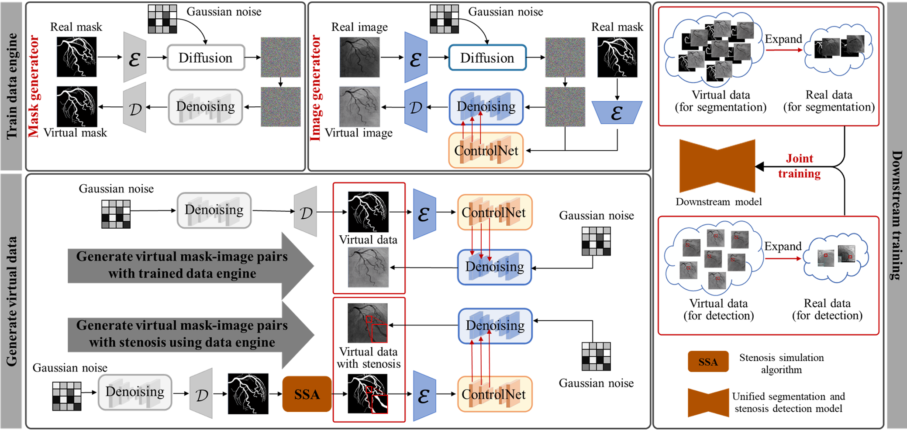
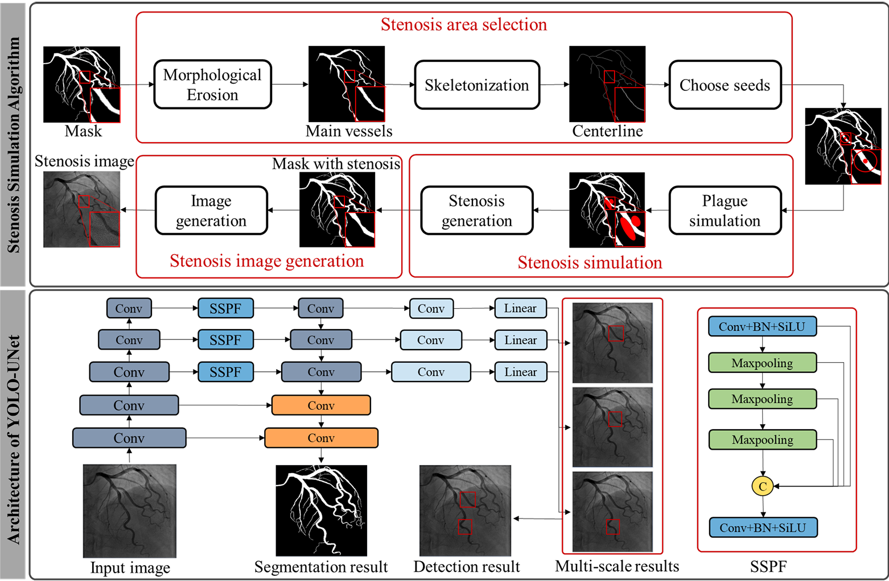

# Generative coronary artery engine for vessel segmentation and stenosis detection

The code for "Generative coronary artery engine for vessel segmentation and stenosis detection".

<p align="center"></p>
<p align="center"></p>

## Setup
```bash
pip install -r requirements.txt
```

## Config
See `configs/config.yaml` for paths and hyperparameters.


## Train multi-task model
```bash
python src/train.py --config configs/config.yaml
```

## Generate virtual data
```bash
python scripts/generate_virtual_data.py --config configs/config.yaml
```